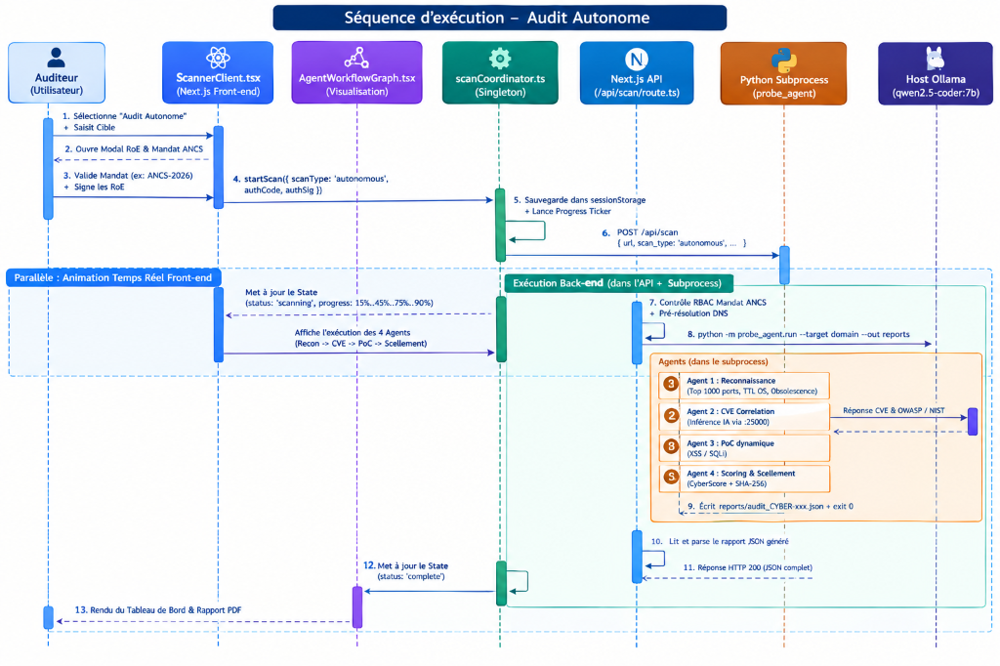
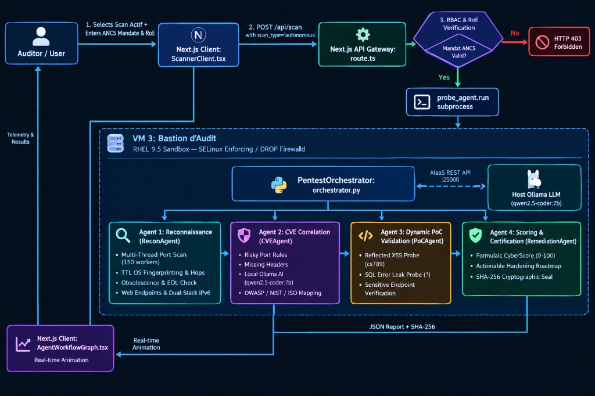

# CyberScore TN — Autonomous Multi-Agent AI Pentest Probe (`probe_agent`)

<p align="center">
  
</p>

<p align="center">
  <a href="https://www.python.org/"></a>
  <a href="https://nextjs.org/"></a>
  <a href="https://ollama.ai/"></a>
  <a href="https://www.redhat.com/"></a>
  <a href="https://en.wikipedia.org/wiki/Security-Enhanced_Linux"></a>
  <a href="https://firewalld.org/"></a>
  <a href="LICENSE"></a>
</p>

---

## 📌 Executive Summary

**CyberScore TN — Probe Agent** is an **autonomous, 4-agent offensive security probe** designed for sovereign cybersecurity auditing of governmental and critical infrastructure. 

Unlike standard passive scanners that merely collect public DNS records and TLS certificates without probing the host, this **Active Scan (Audit Autonome)** deploys an isolated state-graph pipeline:
1. Performs high-speed multi-threaded TCP port scanning across the **Top 1000 ports**.
2. Extracts banner fingerprints and performs **TCP/IP TTL OS distance derivation**.
3. Correlates components against an **End-Of-Life (EOL) historical CVE database**.
4. Interrogates a decoupled local **Sovereign LLM (`qwen2.5-coder:7b`)** over a secure REST link.
5. Executes **controlled, non-destructive dynamic Proof-of-Concept (PoC) probes** to confirm exploitability with zero false positives.
6. Computes a formulaic **CyberScore (0–100)**, generates copyable bash hardening scripts, and computes an immutable **SHA-256 cryptographic seal**.

---

## 🏗️ High-Level System Architecture

The active scan operates across an isolated, multi-tier decoupled infrastructure designed to prevent any lateral movement or cloud data leakage:

| Architecture Layer | Core Component & Technology | Key Security & Operational Responsibilities |
| :--- | :--- | :--- |
| **Tier 1: Front-End UI & State** | `ScannerClient.tsx`<br>`AgentWorkflowGraph.tsx`<br>`scanCoordinator.ts`<br>*(Next.js 14 App Router)* | • Enforces viewer access restrictions and renders the RoE modal.<br>• Real-time animated 4-agent graph with live pulse indicators.<br>• Session persistence via in-memory singleton across language switches (FR ↔ AR ↔ EN). |
| **Tier 2: API Gatekeeper & RBAC** | `route.ts`<br>*(Next.js Server API Gateway)* | • Validates the official ANCS mandate code (`ANCS-2026`) and RoE consent.<br>• Resolves DNS & checks sovereign IP ranges (ATI AS2609: `193.95.*`, `41.22.*`).<br>• Spawns the isolated Python sub-process with strict 240s timeout. |
| **Tier 3: Audit Bastion Sandbox** | **VM 3: `CyberScore-Agent-Probe`**<br>*(RHEL 9.5 Minimal — 192.168.98.148)* | • **SELinux in `Enforcing` mode** for strict process confinement.<br>• **Firewalld with default `DROP` policy** to isolate the offensive machinery.<br>• Ultra-lightweight memory footprint (**< 50 MB RAM**). |
| **Tier 4: Multi-Agent Pipeline** | `PentestOrchestrator`<br>*(4 Specialized Python Agents)* | • **Agent 1:** 150-thread Top 1000 port scan, ICMP TTL OS fingerprinting, EOL database.<br>• **Agent 2:** Deterministic flaw correlation & OWASP/NIST mapping.<br>• **Agent 3:** Non-destructive PoC verification (`cs789<cs_test>`, SQL syntax errors).<br>• **Agent 4:** CyberScore deduction formula, hardening roadmap & SHA-256 seal. |
| **Tier 5: Sovereign AI Reasoning** | **Host Ollama Node**<br>*(Qwen2.5-Coder:7B on port :25000)* | • Decoupled local AIaaS connection with zero external cloud dependencies.<br>• Deterministic parameters (`temperature=0.1`, `format="json"`) eliminating hallucinations. |
| **Tier 6: Delivery & Integrity** | `AuditState` + `ReportGenerator`<br>*(JSON & PDF Engines)* | • Computes immutable SHA-256 state seal for non-repudiation.<br>• Formats multi-lingual JSON report and renders official sovereign PDF certificates. |

---

## ⚡ Execution Sequence Flow

The following chronological sequence illustrates the complete lifecycle from the moment an auditor triggers the active scan to the generation of the certified audit report:

<p align="center">
  
</p>

---

## 🖥️ Front-End Architecture Deep Dive

The front-end is specifically crafted for high-stakes cybersecurity auditing with zero state loss and real-time execution telemetry.

### 1. The Audit Controller UI: [`ScannerClient.tsx`](frontend/components/scanner/ScannerClient.tsx)
* **Scan Type Toggle:** Integrates `autonomous` as a high-tier option (`duration: "~35s"`, `scanners: 4`, `icon: Sparkles`).
* **RBAC Enforcement for Viewers:** Users with role `viewer` are immediately blocked from triggering active scans; a modal guides them to request auditor credentials or switch to an authorized session.
* **Modal de Conformité ANCS & RoE:**
  * Displays classification badge `TLP:AMBER — DIFFUSION RESTREINTE`.
  * Verifies official authorization codes (`ANCS-2026`, `ANCS-SEC-2026`, `ANCS-VAL-2026`).
  * Requires 3 mandatory checkboxes:
    1. *Mandat officiel d'audit délivré par l'ANCS ou le ministère de tutelle.*
    2. *Respect de la plage horaire autorisée et non-perturbation du service.*
    3. *Classification des résultats sous TLP:AMBER.*
  * Logs the digital signature of the inspecting officer.
* **Results Dashboard:**
  * **Certification Badge:** Displays verified ANCS mandate reference, auditor signature, and cryptographic SHA-256 seal.
  * **Score & Grade:** Sovereign grade (`A+` to `F`) with bilingual Arabic/French national status labels.
  * **Interactive Hardening Roadmap:** Each remediation step features a one-click CLI command copy button (`copyCommand()`) with clipboard feedback.

### 2. Real-Time Animated Graph: [`AgentWorkflowGraph.tsx`](frontend/components/scanner/AgentWorkflowGraph.tsx)
* **Active Execution Bands:**
  * `0% – 25%`: **Agent 1: Reconnaissance** (Cyan glow `#00e5ff` — Top 1000 ports, TTL OS, EOL).
  * `25% – 50%`: **Agent 2: Corrélation CVE & IA** (Purple glow `#a855f7` — Ollama inference, OWASP/NIST mapping).
  * `50% – 75%`: **Agent 3: Validation PoC** (Amber glow `#f59e0b` — Dynamic non-destructive reflection probes).
  * `75% – 100%`: **Agent 4: Remédiation & Scellement** (Emerald glow `#10b981` — Hardening script & SHA-256 seal).
* **Live Terminal Telemetry:** Streams terminal output lines, socket probe logs, and completed subtask checklists.

### 3. Global State Coordinator: [`scanCoordinator.ts`](frontend/lib/scanCoordinator.ts)
* **In-Memory Singleton:** Guarantees that the scan keeps running in the background even if the user switches languages (FR $\leftrightarrow$ AR $\leftrightarrow$ EN) or navigates across app tabs.
* **Session Persistence:** Automatically synchronizes state to `sessionStorage` under `cyberscore_scanner_state_v1`.
* **Dynamic Progress Ticker (`startProgressTicker`):** Smoothly advances progress through the 4 agent milestones while waiting for the back-end response.

---

## ⚙️ Back-End API Gateway Deep Dive

The back-end bridge between the Next.js web application and the Python probe engine is implemented in [`backend/api/scan/route.ts`](backend/api/scan/route.ts):

### 1. Live DNS & Sovereign Infrastructure Check
* Resolves the domain via `dns.lookup`.
* Performs a national infrastructure pre-check (ATI AS2609 IP ranges: `193.95.*` or `41.22.*`).
* Returns `HTTP 422` if the host cannot be resolved on the public Internet.

### 2. ANCS-RBAC Gatekeeper
```typescript
if (scanType === "autonomous") {
  const validCodes = ["ANCS-2026", "ANCS-SEC-2026", "ANCS-VAL-2026"];
  const isCodeValid = validCodes.includes(authorizationCode.toUpperCase()) || authorizationCode.toUpperCase().startsWith("ANCS-");
  
  if (!isCodeValid || !roeAccepted || !auditorSignature) {
    return NextResponse.json(
      { error: "Accès Refusé [ANCS-RBAC] : L'Audit Autonome Multi-Agents requiert un Mandat ANCS valide..." },
      { status: 403 }
    );
  }
}
```

### 3. Subprocess Execution (`runAutonomousPythonAgent`)
* Dynamically locates Python across multiple candidate environments (`.venv/bin/python`, `.venv/Scripts/python.exe`).
* Spawns: `python -m probe_agent.run --target <cleanDomain> --out <reportsDir>` with a strict 240-second timeout.
* Captures `stdout`, extracts the generated report file path (matching regex `reports/audit_CYBER-*.json`).
* Ingests, parses, and normalizes the JSON report with full multilinguality (French, Arabic, English).

---

## 🤖 The 4 Autonomous Cooperative Agents

The probe engine operates via a shared [`AuditState`](probe_agent/models.py) state machine through 4 stages:

### 1. Agent 1: Advanced Reconnaissance & Fingerprinting ([`recon_agent.py`](probe_agent/agents/recon_agent.py))
* **High-Speed Socket Port Scanner ([`port_scanner.py`](probe_agent/tools/port_scanner.py)):**
  * Powered by `ThreadPoolExecutor` with **150 concurrent workers**.
  * Targets the **Top 1000 Nmap TCP ports** with priority ordering on critical services (21, 22, 23, 25, 53, 80, 443, 445, 1433, 3306, 3389, 5432, 6379, 8080, 27017, etc.).
  * Direct socket connect with timeout resilience and automatic banner grabbing.
* **IP TTL OS Fingerprinting ([`os_fingerprinter.py`](probe_agent/tools/os_fingerprinter.py)):**
  * Analyzes IP Packet **TTL (Time-To-Live)** and calculates network hop distance:
    * $\text{TTL} \le 64 \implies$ **Linux / Unix** ($\text{Hops} = 64 - \text{TTL}$).
    * $\text{TTL} \le 128 \implies$ **Microsoft Windows Server** ($\text{Hops} = 128 - \text{TTL}$).
    * $\text{TTL} \le 255 \implies$ **Cisco / Solaris / BSD** ($\text{Hops} = 255 - \text{TTL}$).
  * Correlates TTL data with server response headers (e.g. `Ubuntu-2ubuntu2.13`, `IIS/10.0`, `Apache/2.4.7`).
* **Software Obsolescence & EOL Engine ([`obsolescence_checker.py`](probe_agent/tools/obsolescence_checker.py)):**
  * Inspects software strings against an historical End-Of-Life knowledge base.
  * Calculates exact release age (e.g. Apache 2.4.7 released in 2013 = 10+ years old) and associates historical CVE references (`CVE-2014-0226`, `CVE-2017-9798`, `CVE-2021-41773`).
* **Web Surface & Protocol Probing ([`web_inspector.py`](probe_agent/tools/web_inspector.py)):**
  * Tests HTTP `OPTIONS` to identify permitted HTTP methods (`GET`, `POST`, `PUT`, `DELETE`).
  * Resolves dual-stack **IPv6 (AAAA)** records via socket or secure DNS-over-HTTPS fallback.
  * Probes sensitive public endpoints (`/.git/HEAD`, `/.env`, `/phpinfo.php`, `/admin/`, `/robots.txt`).

---

### 2. Agent 2: CVE & Vulnerability Correlation ([`cve_agent.py`](probe_agent/agents/cve_agent.py))
* **Deterministic Risk Rules:**
  * Flags exposed administrative services without TLS/tunnels (e.g. Port 3389 RDP $\to$ CVSS 8.5, Port 445 SMB $\to$ CVSS 8.5, Port 23 Telnet $\to$ CVSS 8.5).
  * Enforces checks for missing HTTP security headers (`Strict-Transport-Security`, `Content-Security-Policy`, `X-Frame-Options`, `X-Content-Type-Options`).
  * Automatically injects obsolescence findings with severity scaled to software age.
* **Contextual AI Reasoning ([`ai_client.py`](probe_agent/ai_client.py)):**
  * Connects over REST to the local **Host Ollama LLM (`qwen2.5-coder:7b`)**.
  * Candidate endpoints auto-probed: `192.168.98.1:25000`, `127.0.0.1:25000`, `11434`.
  * Configured with strict parameters (`temperature=0.1`, `top_p=0.9`, `num_predict=250`, `format="json"`) to guarantee reproducible, hallucination-free outputs.
  * Maps findings to:
    * **OWASP Top 10 (2021):** `A01: Broken Access Control`, `A03: Injection`, `A05: Security Misconfiguration`, `A06: Vulnerable and Outdated Components`.
    * **NIST Cybersecurity Framework (CSF):** `PR.PT-3`, `PR.DS-2`, `ID.RA-1`.
    * **ISO/IEC 27001:** `A.8.8`, `A.8.20`, `A.8.24`.

---

### 3. Agent 3: Dynamic PoC Validation ([`poc_agent.py`](probe_agent/agents/poc_agent.py))
To avoid false alarms, Agent 3 executes safe, controlled, non-destructive validation probes ([`poc_verifier.py`](probe_agent/tools/poc_verifier.py)):
* **Reflected XSS Probe:**
  * Injects a benign marker: `cs789<cs_test>`.
  * Checks if the marker is returned **unescaped** in the HTML response. If found, sets `poc_verified: true` with evidence.
* **SQL Injection Error Disclosure Probe:**
  * Sends a single quote (`'`) to query parameters.
  * Inspects response bodies for database syntax error signatures:
    * `You have an error in your SQL syntax` (MySQL / MariaDB)
    * `mysql_fetch_array`
    * `pg_query` (PostgreSQL)
    * `SQLite3::`
    * `ORA-[0-9]{5}` (Oracle DB)
    * `ODBC SQL Server Driver` (Microsoft SQL Server)
* **Sensitive File Exposure:**
  * Validates whether `/.git/HEAD` leaks `ref: refs/heads/`, or `/phpinfo.php` exposes the active PHP configuration table.

---

### 4. Agent 4: Remediation, Scoring & Certification ([`remediation_agent.py`](probe_agent/agents/remediation_agent.py))
* **Mathematical CyberScore Formula:**
  Starting from a clean score of **100**, deductions are applied proportionally to validated severity:
  
  $$\text{CyberScore} = \max\left(10, \; \min\left(100, \; 100 - (22 \times N_{\text{crit}}) - (12 \times N_{\text{high}}) - (6 \times N_{\text{med}}) - (2 \times N_{\text{low}})\right)\right)$$

* **Tunisian National Grade Scale:**
  * **Grade A / A+ (85 – 100):** Sovereign Resilience (Minimal to Zero Risk).
  * **Grade B / B+ (70 – 84):** Good (Acceptable risk, minor configuration adjustments needed).
  * **Grade C / C+ (55 – 69):** Medium (Requires scheduled remediation).
  * **Grade D (40 – 54):** Weak (Significant exposure detected).
  * **Grade F (< 40):** Critical (High-risk vulnerabilities requiring immediate intervention).

* **Multi-Agent Component Breakdown:**
  * **Agent 1:** Port Exposure & Network Recon Score (100 base, deductions for exposed risky ports and missing TLS).
  * **Agent 2:** CVE & Configuration Flaw Score (Derived from OWASP/NIST finding severities).
  * **Agent 3:** PoC Resistance Score (Measures active immunity against dynamic exploit vectors).
  * **Agent 4:** Hardening Readiness & Cryptographic Seal Score (100 when roadmap & SHA-256 seal are complete).

* **Tailored Hardening Roadmap:**
  * Produces step-by-step CLI commands (e.g. `ufw deny 3306/tcp`, `firewall-cmd --remove-port=3389/tcp`, Nginx HSTS directives).

* **Cryptographic SHA-256 Seal ([`models.py`](probe_agent/models.py)):**
  * Computes an immutable hash over the entire audit state:
    $$\text{SHA-256}(\text{ScanID} \parallel \text{Target} \parallel \text{IP} \parallel \text{Score} \parallel \text{Grade} \parallel \text{Timestamp})$$
  * Guarantees non-repudiation and report authenticity for official defense audits.

---

## 📊 Data Exchange Payload Specification (JSON Schema)

When the back-end completes the audit, it returns the following structured JSON payload to the front-end:

| JSON Key | Type | Description |
| :--- | :--- | :--- |
| `is_autonomous_agent` | `boolean` | `true` (enables the multi-agent telemetry view in the UI) |
| `mandat_reference` | `string` | Official ANCS authorization mandate (e.g. `ANCS-2026`) |
| `auditor_signature` | `string` | Digital signature of the inspecting auditor |
| `sha256_hash` | `string` | Cryptographic SHA-256 seal of the audit state |
| `total_score` & `grade` | `number`, `string` | Final CyberScore (0–100) and sovereign grade (`A+` to `F`) |
| `agent_scores` | `object` | Scores for the 4 agents (`recon_ports`, `cve_analysis`, `poc_validation`, `remediation_seal`) |
| `open_ports` | `array` | List of detected open ports with service name, banner, and risk status |
| `os_detection` | `object` | OS family, detailed release, TTL received, hop distance, and RTT latency |
| `software_obsolescence`| `array` | Detected EOL components, release age in years, and sample CVEs |
| `findings` | `array` | Vulnerabilities with CVSS score, OWASP category, raw evidence, and `poc_verified` flag |
| `remediation_roadmap` | `array` | Prioritized remediation steps with copyable bash commands |

---

## 📁 Repository Structure

```
cyberscore-probe-agent/
├── README.md                           # Documentation & architecture specifications
├── LICENSE                             # MIT License
├── requirements.txt                    # Python dependencies
├── .gitignore                          # Git exclusions
│
├── docs/
│   └── images/
│       ├── architecture.png            # High-level architecture & VM bastion diagram
│       └── execution_sequence.jpg      # Chronological execution sequence diagram
│
├── probe_agent/                        # CORE AUTONOMOUS MULTI-AGENT PENTEST ENGINE
│   ├── __init__.py
│   ├── run.py                          # Standalone CLI entrypoint
│   ├── orchestrator.py                 # 4-agent state graph pipeline orchestrator
│   ├── models.py                       # Dataclasses (AuditState, Findings, SHA-256 seal)
│   ├── config.py                       # Network timeouts, candidate AI URLs, sensitive endpoints
│   ├── ai_client.py                    # Decoupled Ollama AIaaS client (qwen2.5-coder:7b)
│   ├── deploy_to_vm.sh                 # RHEL 9.5 VM Bastion automated deployment script
│   │
│   ├── agents/
│   │   ├── __init__.py
│   │   ├── recon_agent.py              # Agent 1: Reconnaissance & Fingerprinting
│   │   ├── cve_agent.py                # Agent 2: CVE Correlation & AI Reasoning
│   │   ├── poc_agent.py                # Agent 3: Dynamic PoC Validation
│   │   └── remediation_agent.py        # Agent 4: Remediation, Scoring & SHA-256 Seal
│   │
│   └── tools/
│       ├── __init__.py
│       ├── port_scanner.py             # 150-thread socket port scanner (Top 1000 ports)
│       ├── os_fingerprinter.py         # ICMP TTL & hop distance OS detector
│       ├── obsolescence_checker.py     # Software EOL & historical CVE analyzer
│       ├── web_inspector.py            # HTTP headers, OPTIONS method, IPv6 AAAA
│       └── poc_verifier.py             # Non-destructive XSS, SQLi & leak verification
│
├── backend/                            # BACKEND API GATEWAY
│   └── api/
│       └── scan/
│           └── route.ts                # Next.js API route: RBAC gate, subprocess runner & JSON parser
│
└── frontend/                           # FRONTEND REACT / NEXT.JS MODULES
    ├── components/
    │   └── scanner/
    │       ├── ScannerClient.tsx       # Main UI, RoE modal, mandate gate & results view
    │       └── AgentWorkflowGraph.tsx  # Live animated 4-agent workflow graph & terminal
    └── lib/
        ├── scanCoordinator.ts          # State manager singleton, ticker & sessionStorage
        └── report-data.ts              # Data formatting & report conversion helpers
```

---

## 🚀 Quickstart & Usage

### 1. Standalone CLI Execution (Fastest Way to Test)

The engine can be executed directly with Python 3.9+:

```bash
# Clone the repository
git clone https://github.com/YosriSecOps/cyberscore-probe-agent.git
cd cyberscore-probe-agent

# Install dependencies (Standard library is primary; utilities are minimal)
pip install -r requirements.txt

# Run the 4-agent probe against a target
python -m probe_agent.run --target scanme.nmap.org --out reports
```

#### Sample Terminal Output:
```text
======================================================================
     CYBERSCORE TN -- AUTONOMOUS SECURITY PENTEST PROBE
   Multi-Agent Architecture & Local Sovereign AI Orchestration
        Reference : TEK-UP SSIRF & ANCS National Framework
======================================================================

======================================================================
RÉSULTATS DE L'AUDIT DE SÉCURITÉ — scanme.nmap.org
ID d'Audit       : CYBER-E3A917F4
Adresse IP       : 45.33.32.156
Durée d'Analyse  : 14.82 secondes
Score National   : 78/100 (Grade B)
Empreinte SHA256 : 7f8a9b3c2d1e0f4a5b6c7d8e9f0a1b2c3d4e5f6a7b8c9d0e1f2a3b4c5d6e7f8a
======================================================================

1. CARTOGRAPHIE DES PORTS & SERVICES RÉSEAU :
  • Port    22/TCP : SSH             [NORMAL]      OpenSSH 6.6.1p1 Ubuntu
  • Port    80/TCP : HTTP            [NORMAL]      Apache/2.4.7 (Ubuntu)
  • Port  9929/TCP : Nping-Echo      [NORMAL]      nping-echo

2. VULNÉRABILITÉS VALIDÉES (TRIÉES PAR GRAVITÉ) :
  [HIGH]     Composant obsolète : Apache HTTP Server 2.4.7 (CVSS 8.0)
  [HIGH]     Absence du header HTTP Strict-Transport-Security (HSTS) (CVSS 7.4) [PoC CONFIRMÉ]
  [HIGH]     Absence de politique Content-Security-Policy (CSP) (CVSS 7.1) [PoC CONFIRMÉ]

3. FEUILLE DE ROUTE DE REMÉDIATION TECHNIQUE :
  [ÉTAPE 1] Activer le Durcissement TLS & HSTS (+12 pts)
    $ sudo a2enmod headers
    $ echo 'Header always set Strict-Transport-Security "max-age=31536000; includeSubDomains" always;' >> /etc/apache2/conf-available/security.conf

[✓] Rapport complet enregistré avec succès dans : reports/audit_CYBER-E3A917F4.json
```

---

### 2. Hardened Bastion Deployment (VM 3 — RHEL 9.5)

For institutional production deployment inside an isolated sandbox VM:

```bash
# Copy the deploy script to the RHEL 9.5 VM
scp probe_agent/deploy_to_vm.sh root@192.168.98.148:/opt/

# SSH into the Bastion and run the deployment script
ssh root@192.168.98.148
chmod +x /opt/deploy_to_vm.sh
/opt/deploy_to_vm.sh
```

The script automatically:
* Installs required packages (`python3`, `git`, `firewalld`).
* Sets **SELinux** to `Enforcing` mode.
* Configures **Firewalld** with a default `DROP` policy, opening only outbound ephemeral ports toward scan targets and inbound port `25000` to the Ollama AI host.
* Creates the systemd service unit for autonomous probe scheduling.

---

### 3. Integration with Next.js Frontend

1. Copy `backend/api/scan/route.ts` into your Next.js `app/api/scan/route.ts`.
2. Add `frontend/components/scanner/` and `frontend/lib/` to your Next.js application.
3. Launch the Next.js server (`npm run dev`).
4. Navigate to `/scanner`, click **Audit Autonome**, enter the authorization code (`ANCS-2026`), accept the RoE, and observe the live multi-agent graph in real time!

---

## 🛡️ Security & Ethical Disclaimer

This tool is intended exclusively for authorized cybersecurity auditing, sovereign vulnerability assessments, and educational research within legitimate legal mandates (e.g., ANCS authorization in Tunisia). Running active penetration tests against systems without prior explicit written permission is illegal.

---

## 👨‍💻 Author & Academic Reference

* **Author:** Yosri Hamdouni ([@YosriSecOps](https://github.com/YosriSecOps)) & Wajdi Hamdi
* **Project:** CyberScore TN — Sovereign Cybersecurity Evaluation Platform
* **Academic Reference:** TEK-UP PFA / ANCS National Cybersecurity Framework
* **License:** [MIT License](LICENSE)
